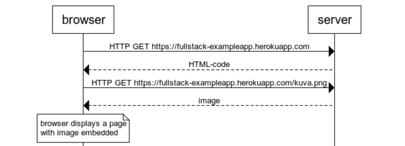
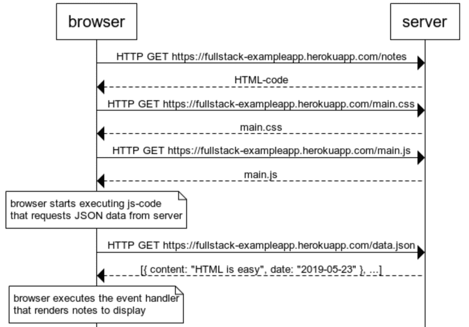

### `Part 0: (a)` - General Info
* Nothing noted here.
* I don't know if I care about the Open University credits thing, I will be focusing on how submitting tasks works for now.
---
---
### `Part 0: (b)` - Fundmentals of web apps
* "Always keep the Developer Console open when developing web applications."
* "The server and the web browser communicate with each other using the HTTP protocol."
* "The browser uses this information (`content-type`) to render the image correctly to the screen."

* "Even though it is difficult to notice, the HTML page begins to render before the image has been fetched from the server."
  * I think some sites makes us wait till the image loads no?
* "Traditional web applications"
  * When entering the page, the browser fetches the HTML document detailing the structure and the textual content of the page from the server.
  * The said document can be static or dynamic.
  * See mentioned code [Here](https://fullstackopen.com/en/part0/fundamentals_of_web_apps#traditional-web-applications)
  * Writing HTML in the midst of the code is of course not smart, but for old-school PHP-programmers it was a normal practice.
  * The browser is "dumb". It only fetches HTML data from the server, and all application logic is on the server.
* "The sample code in this part is actually not relevant at all to the coding techniques of this course."😂
* "Event handler functions are called callback functions."
* "The application code does not invoke the functions itself, but the runtime environment - the browser, invokes the function at an appropriate time, when the event has occurred."
* "The functioning of the browser is based on the idea of depicting HTML elements as a tree."

* `Status code 302`: Asks the browser to reload to the address in `header's location`.
* `AJAX`: Fetching of content to web-pages without having to re-render the page.
  * The thing termed AJAX is now so commonplace that it's taken for granted. The term has faded into oblivion, and the new generation has not even heard of it.
* `SPA`: comprise only one HTML page fetched from the server, the contents of which are manipulated with JavaScript that executes in the browser.
#### I think I can conclude that in recent years more and more logic have been added on the Front end part of Web development, at least after seeing the `Example app`.
---
---
* *Time Elapsed:* `~5H50M`.
* \+ More time for trying to figure out how submission system works 😌 
##### END.