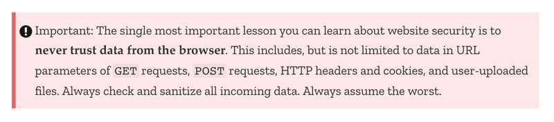

### `Part 7: (a)` React-router

- In an old school web app, changing the page shown by the application would be accomplished by the browser making an HTTP GET request to the server and rendering the HTML representing the view that was returned.
  - I suppose old school web app means server side rendering, or some form of it.
- In single page apps, we are, in reality, always on the same page. The Javascript code run by the browser creates an illusion of different "pages". If HTTP requests are made when switching view, they are only for fetching JSON-formatted data, which the new view might require for it to be shown.
  - again, single page apps, kind of mainly client side rendering I suppose.
- React has the `React Router` library which provides an excellent solution for managing navigation in a React application.
- Normally the browser loads a new page when the URL in the address bar changes. However, with the help of the HTML5 history API, BrowserRouter enables us to use the URL in the address bar of the browser for internal "routing" in a React application. So, even if the URL in the address bar changes, the content of the page is only manipulated using Javascript, and the browser will not load new content from the server. Using the back and forward actions, as well as making bookmarks, is still logical like on a traditional web page.
- The Routes works by rendering the first component whose path matches the url in the browser's address bar.
- Both useParams and useNavigate are hook functions, just like useState and useEffect which we have used many times now.
- It is not possible to use the `useMatch` hook in the component which defines the routed part of the application. Let's move the use of the `Router` components from App
- If the url matches `/notes/:id`, the match variable will contain an object from which we can access the parameterized part of the path

---

---

### `Part 7: (b)` Custom hooks

- Redux's hook-based api is a lot easier to use than its older, still available, connect API.
- `React-router` is also partially hook-based. Its hooks can be used to access url parameters and the navigation object, which allows for manipulating the browser url programmatically.
- Some rules of hooks:
  - Don’t call Hooks inside loops, conditions, or nested functions.
    - Instead, always use Hooks at the top level of your React function.
  - Don’t call Hooks from regular JavaScript functions. Instead, you can:
    - Call Hooks from React function components.
    - Call Hooks from custom Hooks
- the primary purpose of custom hooks is to facilitate the reuse of the logic used in components.
- About creating custom hooks:
  - `hooks` are regurlar JS functions that start with `use`, they can use any `react-hooks` and adhere to the `rules of hooks.
  - By exracting the logic of `counter` in it's own `useCounter`, we allow for re-use of that hook, and we separated the `app` from the `state`.
  - Custom hooks are clearly not only a tool for reuse, they also provide a better way for dividing our code into smaller modular parts.
- About passing props:

```JS
<Greeting firstName='Arto' lastName='Hellas' />

const person = {
  firstName: 'Arto',
  lastName: 'Hellas'
}

<Greeting {...person} />
```

---

---

### `Part 7: (c)` More about styles

- Recently, there has been an explosion in the number of new UI frameworks that have entered the arena. In fact, the selection is so vast that there is little hope of creating an exhaustive list of options.
- UI Frameroks options:
  - UI Frameroks = "components" with their CSS & JS.
  - Bootstrap
    - For react: `reactstrap`, `react-bootstrap`, because you need it to be actualy "react components"
  - Material UI
- In Bootstrap, all of the contents of the application are typically rendered inside of a container. In practice this is accomplished by giving the root `div` element of the application the `container` class attribute.
- Bootstrap and a large majority of existing UI frameworks _produce responsive designs_, meaning that the resulting applications render well on a variety of different screen sizes.
- Chrome developer tools makes it possible to simulate using our application in the browser of different mobile clients.
- As our second example we will look into the `MaterialUI` React library, which implements the `Material design` visual language developed by Google.
- Render the contents of the whole application within a `Container`.
- MaterialUI, unlike Bootstrap, does not provide a component for the form itself. The form here is an ordinary HTML form element.
- We can use component props to define how the root element of a MaterialUI component is rendered

```JS
<Button color="inherit">
  <Link to="/">home</Link>
</Button>

<Button color="inherit" component={Link} to="/">
  home
</Button>
```

- Two ways of importing UI frameworks
  - using exitent React-integrastion libraries.
    - Some potential downsides to using UI frameworks through integration libraries instead of using them "directly" are that integration libraries may have unstable APIs and poor documentation.
  - or using HTML elements + their CSS.
    - But this will make youy include unpleasant JS code.
- There's `Semantic UI React` which is an official UI framework.
- There is also the question of whether or not UI framework libraries should be used in the first place. It is up to everyone to form their own opinion, but for people lacking knowledge in CSS and web design, they are very useful tools.
  - I plan to focus on backend, so I think FSO has been probably _much_ more than enough frontend 🤔
  - I think it boils down to if you want to implement your own ideas vs settling down for ready-made limited edits designs 🤷🏻‍♀️
- Other UI Frameworks:
  - bulma zip file
  - get.foundation zip file
  - semantic ui react library
  - mantine.dev react library
  - tailwindcss honorable mention, needs CSS skills tho.
- Styled components have seen a consistent growth in popularity in recent times, and quite a lot of people consider it to be the best way of defining styles in React applications.

---

---

### `Part 7: (d)` Webpack

- A better development workflow has probably never existed for browser-side JavaScript development.
  - Talking about `create-react-app`
- One of the key players in making React applications functional is a tool called `webpack`.
- the older browsers actually do not know how to handle code that is divided into modules.
- For this reason, code that is divided into modules must be bundled for browsers, meaning that all of the source code files are transformed into a single file that contains all of the application code.
- Under the hood, the npm script bundles the source code using webpack
  - Like we did in `part3` using `npm run build`.
- Although we may have become unaware of it, we are actually using JSX for rendering our views in React.
- We can use `loaders` to inform webpack of the files that need to be processed before they are bundled.
- About Webpack:
  - Something for static files,
  - something for react, JSX
  - something for async/await
  - something for CSS
  - something for source maps
  - something for minification
  - ... (probably forgot something)
- The process of transforming code from one form of JavaScript to another is called transpiling. The general definition of the term is to compile source code by transforming it from one language to another.
  - From JSX to JS
  - From ES6 and ES7 to ES5 (for browsers)
  - ...
- The current configuration makes it possible to develop our application but the workflow is awful (to the point where it resembles the development workflow with Java).
  - Huh... what about Java?
  - `webpack-dev-server` will help in this.
- The process for updating the code is fast. When we use the dev-server, the code is not bundled the usual way into the main.js file. The result of the bundling exists only in memory.
- We will ask webpack to generate a so-called `source map` for the bundle, which makes it possible to map errors that occur during the execution of the bundle to the corresponding part in the original source code.
- The optimization process for JavaScript files is called minification. One of the leading tools intended for this purpose is UglifyJS.
- How can we change the address in a controlled fashion to point to the production backend server when the code is bundled for production?
  - erm... `.env`?
- If the configuration for development and production differs a lot, it may be a good idea to separate the configuration of the two into their own files.
- We can inspect the bundled production version of the application locally by executing the following command in the build directory
  - `npx static-server`
- If we want the application to be IE-compatible, we need to add a polyfill, which is code that adds the missing functionality to older browsers.
- The browser compatibility of different APIs can be checked by visiting https://caniuse.com or [Mozilla's website](https://developer.mozilla.org/en-US/).
- `Eject` create-react-app, remove black-magic, better start studying magic from scratch for this one.
  - but is extremely educational, knowing what happens behind the scenes.

---

---

### `Part 7: (e)` Class components, Miscellaneous

- Stateful functional components were not possible until version `16.8` of React (hooks),
  - Only way to create state was through using `Class syntax`

```JS
import React from 'react'

class App extends React.Component {
  constructor(props) {
    super(props)
  }

  render() {
    return (
      <div>
        <h1>anecdote of the day</h1>
      </div>
    )
  }
}

export default App
```

- About class components:
  - The state is initialized in the constructor
  - Class Components has one state object.
  - The `lifecycle methods` of Class Components offer corresponding functionality. ?as hooks?
  - Calling the method `setState` always triggers the rerender of the Class Component, i.e. calling the method `render.`
- The biggest difference between Functional components and Class components is mainly that the state of a Class component is a single object, and that the state is updated using the method setState, while in Functional components the state can consist of multiple different variables, with all of them having their own update function.
- In some more advanced use cases, the effect hook offers a considerably better mechanism for controlling side effects compared to the lifecycle methods of Class Components.

```
...In my opinion, and the opinion of many others, Class Components offer basically no benefits over Functional components enhanced with hooks...
...When writing fresh code, there is no rational reason to use Class Components if the project is using React with a version number 16.8 or greater...
```

- About virtual DOM:
  - Browser has `DOM API`.
  - React has `Virtual DOM`.
  - Developer deals with `Virtual DOM`,
  - React computes optimum way to update DOM, then reflects the new changes using `ReactDOM`.
  - The `React elements` make up the `Virtual DOM`, which is stored in system memory during runtime.
- React is not a framework but a library, it focuses on the `view` in the `Model View Controller` model, you can add `Context API` and `hooks` to make it handle `state management`... which among other added libraries `e.g. axios` could make it a `framework`.
  - Or use `Redux` which implies the `Flux` archeitcutre, using this and `Redux thunk` could separate React from any "Business logic".
- About Security:
  - The Open Web Application Security Project, otherwise known as [OWASP](https://www.owasp.org/), publishes an annual [list](https://owasp.org/www-project-top-ten/) of the most common security risks in Web applications.
  - Injections.. e.g. SQL injection.
    - Mostly prevented by `parameterized queries`.
    - or in NoSQL by `sanitizing` the queries.
  - Cross-site scripting (XSS)
    - React sanitizes the data in variables... [mostly](https://medium.com/dailyjs/exploiting-script-injection-flaws-in-reactjs-883fb1fe36c1).
- About updating librarie:
  - One needs to remain vigilant when using libraries; if there are security updates to those libraries, it is advisable to update those libraries in one's own applications.
    - [Express](https://expressjs.com/en/advanced/security-updates.html), [NodeJS](https://nodejs.org/en/blog/)
  - `npm outdated --depth 0` Checking for updates.
  - `npm install -g npm-check-updates` tool for updating.
  - `npm-check-updates` run tool.
  - Updating `package.json` with `ncu -u`, then finally `npm intall`.
- However, old versions of the dependencies are not necessarily a security risk.
  - The `npm audit` command can be used to check the security of dependencies. It compares the version numbers of the dependencies in your application to a list of the version numbers of dependencies containing known security threats in a centralized error database.
  - Running `npm audit fix` does not update dependencies if their major version number has increased. Updating these dependencies could lead to the whole application breaking down
  - Running `npm audit fix --force` may potentially (or always?) break development envirnoment.
- When implementing access control, one should e.g. remember to not only check a user's identity in the browser but also on the server. Bad security would be to prevent some actions to be taken only by hiding the execution options in the code of the browser.
  - e.g. The delete button in the blogList app, a _"user"_ can send a request regradless of its showing up or not, and if the identitiy isn't checked on the server this results in the _"user"_ doing something he's not authorrized to.
- Securtiy readings:
  - [MDN Security Guide](https://developer.mozilla.org/en-US/docs/Learn/Server-side/First_steps/Website_security)
  - [Express Production Best Practices: Security](https://expressjs.com/en/advanced/best-practice-security.html)
  - Installing library [Helmet](https://helmetjs.github.io/) It includes a set of middlewares that eliminate some security vulnerabilities in Express applications.
  - ESlint [security-plugin](https://github.com/nodesecurity/eslint-plugin-security)
    
- Current trends:
  - Type JS. => TS.
  - Server side rendering (SSR), [read](https://www.javascriptstuff.com/react-seo/) and [this](https://medium.freecodecamp.org/seo-vs-react-is-it-neccessary-to-render-react-pages-in-the-backend-74ce5015c0c9).
  - Isomorphic applications & Universal Code. See [NextJS](https://github.com/zeit/next.js/)
  - Progressive web apps (PWA), installable web apps, that can be offline using [service workers](https://developer.mozilla.org/en-US/docs/Web/API/Service_Worker_API).
  - [Microservice architecture](https://martinfowler.com/articles/microservices.html), is a way of composing the backend of an application from many separate, independent services, which communicate with each other over the network. In a pure microservice architecture, the services do not use a shared database.
  - [Serverless](https://serverless.com/). enables the execution of individual functions in the cloud... Software developers can shift their programming efforts to a higher level of abstraction.
- Useful stuff:
  - Complicated data. [Lodash](https://www.npmjs.com/package/lodash) and [Ramda](https://ramdajs.com/).
  - Times and dates. [date-fns](https://github.com/date-fns/date-fns).
  - Handling forms. [Formik](https://www.npmjs.com/package/formik) and [final-form](https://final-form.org/react/)
  - Displaying graphs. [recharts](http://recharts.org/en-US/) and [highcharts](https://github.com/highcharts/highcharts-react).
  - Immutable implementations of DSs. [immutable.js](https://github.com/facebook/immutable-js/) and [Immer](https://github.com/mweststrate/immer).
  - Async actions (or more like chained actions), other than [Redux Thunk](https://fullstackopen.com/en/part6/communicating_with_server_in_a_redux_application#asynchronous-actions-and-redux-thunk), [Redux-saga](https://redux-saga.js.org/).
  - Gathering of analytical data. [React Google Analytics](https://github.com/react-ga/react-ga).
  - Cross-platform apps... wait for part10 😁
  - In terms of bundling tools, [Webpack](https://www.npmjs.com/package/webpack) has been leading for a while, honorable mentions is [Parcel](https://parceljs.org/), and [Rome](https://rome.tools/), which does lots of different stuff 🤨
  - Rect best practices... [Here](https://reactpatterns.com/) and [here](https://vasanthk.gitbooks.io/react-bits/).
  - [React discord community](https://www.reactiflux.com/)

---

---

# Here

- Many of the exercises in this part of the course material will require the refactoring of existing code. This is a common reality of extending existing applications, meaning that refactoring is an important and necessary skill even if it may feel difficult and unpleasant at times.
  - One good piece of advice for both refactoring and writing new code is to take baby steps.
- Using `context api` to have some _centeralized_ state management [here](https://www.simplethread.com/cant-replace-redux-with-hooks/) and [here](https://hswolff.com/blog/how-to-usecontext-with-usereducer/).
- Changes on the server: (i.e. need to update frontend, due to some changes on server)
  - Polling, using maybe `setInterval`, repeated API requests.
  - Websockets, browser API, two-way communication channel between the browser and the server, [here](https://socket.io/).
  - GraphQL, which is discussed in part8.
- You have to remember that `React` isn't a framework:
  - Creating two separate repositories (frontend-backend) is typical,
  - You can use [this boilerplate code](https://github.com/fullstack-hy2020/create-app) to have them both at the same repo.
  - Or actually learn some React frameworks like `NextJS` or `RemixJS`.
- **There is no one correct way to organize a project.**
  - The way in the course, components in `/components`, reducers in `/reducers`, services in `/services`.
- If I have a purely frontend app, and I have a secret API key, what should I do?
  - a bit of searching, tl;dr don't put sensetive info in anything that's on the client side, given sometime anyone can expose it.
- Why are we putting `hooks` in `/src/hooks/**index.js**`?
- At the end of section `b` there are some material for `hooks`.
  - The one that caught my attention is [why do hooks rely on call order](https://overreacted.io/why-do-hooks-rely-on-call-order/)
- I suppose if we have an asynchronous function in the object returned by `useMatch()`, the result would be having a _white page_ until the promise get fulfilled?
- About `hooks rules`
  - What is this?
    - ??This must be done to ensure that the hooks are always called in the same order, and if this isn't the case the application will behave erratically.??
- _Time Elapsed:_ `~40H00M` About first 10 hours was for sections `a` to `e`, rest of time is for section `f`.
- _Stopped at:_ `P7 - Finished`
